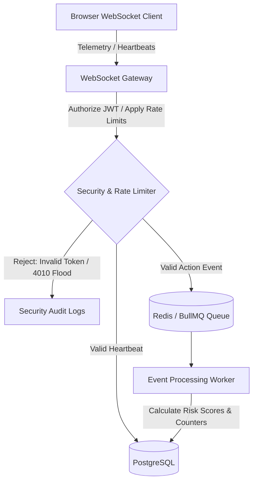
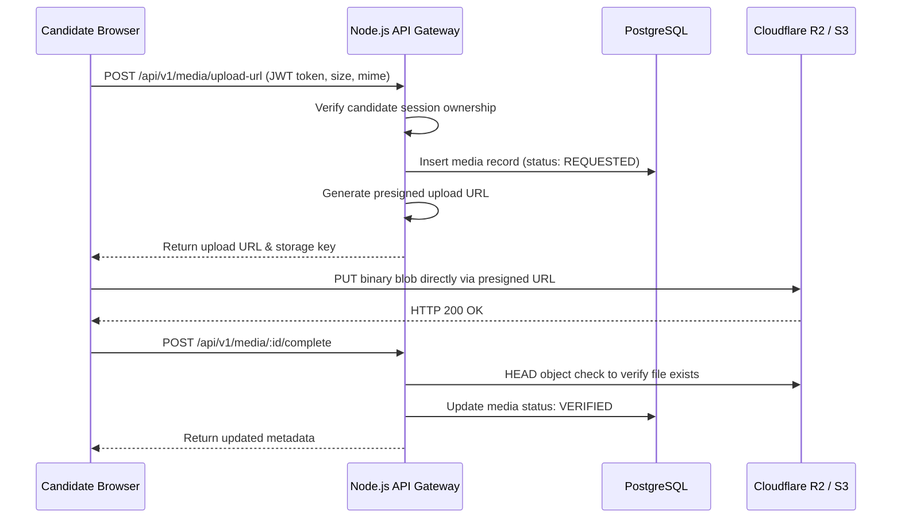
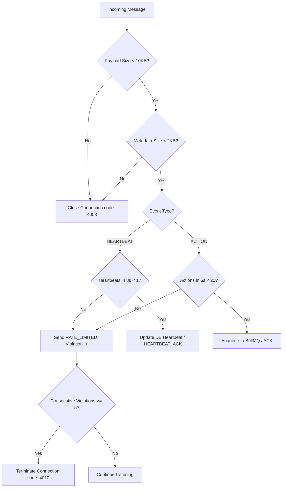

# Proctoring & Telemetry Service

This service provides real-time browser telemetry ingestion and proctoring controls for online assessments, alongside post-exam video recording uploads. It is designed to handle high concurrency (e.g., 100+ concurrent candidates) with robust data integrity, outage resilience, and rate-limiting security guards.

---

## 1. System Architecture

The service splits telemetry event ingestion and heavy media uploading into two parallel, decoupled channels:

### A. Real-Time Telemetry Flow (WebSocket / BullMQ)
Uses a fast-ingestion, asynchronous processing architecture to ensure WebSocket telemetry remains non-blocking:



### B. Media Evidence Ingestion Flow (HTTPS Presigned Upload)
Bypasses the WebSocket and application server when transferring snapshot binary images to avoid system load:



1. **WebSocket Handshake**: Client initiates upgrade providing a signed JWT candidate token.
2. **Replacement Registry**: If a duplicate connection is opened (e.g., from tab refreshes), the registry closes the older socket using code `4009`.
3. **Queue Separation**: Heartbeats update PostgreSQL directly to keep connection metrics fresh. Telemetry actions are pushed to the Redis `proctoring-events` BullMQ queue.
4. **Worker Persistence**: Workers process enqueued telemetry, check for duplicate event IDs, calculate risk increments, and persist results to Postgres.
5. **Direct-to-Bucket Media Ingestion**: Browsers request presigned URLs, upload canvas-captured webcam frames directly to Cloudflare R2 / S3 via PUT, and inform the Node.js API to verify and store metadata.

---

## 2. Security & Rate Limiting Engine

To protect the server from flooding and message exploitation, the WebSocket gateway applies real-time validation:



### Decoupling Infrastructure Failures from Misconduct
*   **Protocol Security Events** (`RATE_LIMITED`, `INVALID_JWT`, `SESSION_MISMATCH`, `PAYLOAD_TOO_LARGE`) are blocked at the gateway, bypass workers/queues, and **never** update candidate risk scores.
*   **Proctoring Incidents** (`TAB_HIDDEN`, `COPY`, `PASTE`) represent behavioural telemetry and updates the candidate's cheating-risk timeline.

---

## 3. Reliability & Data Integrity Invariants

| Invariant | Problem Solved | Technical Resolution |
| :--- | :--- | :--- |
| **Late Event Transformation** | Events arriving after attempt finalization artificially inflate risk scores. | Worker transforms post-exam events into `LATE_EVENT`, preserving the original payload in metadata with no risk score changes. |
| **Idempotency Safeguard** | Worker reprocessing or client retries double-counting anomalies. | PostgreSQL unique constraint `(proctoring_session_id, client_event_id)` triggers `ON CONFLICT DO NOTHING`. |
| **Idempotent Finalization** | Repeated HTTP submissions updating attempt end times. | `endSession` locks the initial `ended_at` timestamp using `COALESCE(ended_at, now())`. |
| **Sequence Gap Check** | Network drops causing packet loss undetected. | Dynamic query-time sequence analytics calculations to identify missing `sequenceNumber` gaps. |
| **Media Upload Isolation** | Media server failures or S3 outages causing candidate exams to crash. | Media is supplemental evidence. Direct HTTP PUT uploads are isolated from core telemetry, and R2 outages will not interrupt active exams or telemetry. |
| **Fail-Fast R2 Verification** | Silently falling back to local files in production due to missing cloud credentials. | The app checks R2 configs on startup. If `MEDIA_STORAGE_PROVIDER=r2` but parameters are missing, the server crashes immediately instead of starting with fallback local storage. |
| **Idempotent Retention Cleanup** | Ongoing cloud storage costs due to unmanaged candidate recordings. | A background worker runs on boot and every 6 hours, deletes expired objects from S3/R2 storage, and marks DB status as `DELETED` in an idempotent manner. |

---

## 4. REST API Endpoint Registry

### Public Endpoints (Authentication Optional)
*   **`GET /health`** / **`GET /api/v1/health`**: Production health checks. Exposes components connectivity without credentials or trace leaks.
    ```json
    {
      "status": "healthy",
      "components": {
        "api": "healthy",
        "database": "healthy",
        "redis": "healthy",
        "queue": "healthy"
      }
    }
    ```

### Internal/Teacher APIs (Require Token/Service Auth)
*   **`POST /internal/sessions`**: Create a proctoring session (called when student starts exam).
*   **`POST /internal/sessions/:id/end`**: Ends the session and stores initial `ended_at` timestamp.
*   **`GET /api/v1/sessions/:id/summary`**: Retrieves session telemetry counters, risk metrics, and sequence gap arrays.
*   **`POST /api/v1/sessions/:id/reviews`**: Append-only administrative session reviews and decisions.

### Media Evidence APIs (JWT Authorized)
*   **`POST /api/v1/media/upload-url` (Student Token)**: Validates session ownership and returns a presigned S3/R2 upload URL.
*   **`POST /api/v1/media/:id/complete` (Student Token)**: Triggers backend object checking to confirm upload and mark metadata as `VERIFIED`.
*   **`GET /api/v1/media/:id/url` (Teacher Token)**: Generates a 5-minute short-lived download URL for reviewers and records a viewing audit log.
*   **`GET /api/v1/sessions/:sessionId/media` (Teacher Token)**: Lists all snapshot media metadata associated with a session's timeline.

---

## 5. Verification Test Suites

Verify changes locally using the test scripts under the `scratch/` directory:

### Telemetry & WebSocket Tests
```bash
# 1. Verify Core Hardening logic (registry, gaps, finalization)
node scratch/test_proctoring_hardening.js

# 2. Verify WebSocket Security & Rate Limits (floods, expiration)
node scratch/test_proctoring_security.js

# 3. Verify E2E Browser Telemetry connection (Puppeteer automation)
node scratch/test_browser_socket_integration.js

# 4. Verify 100-User Storm connection (200ms spaced flushing)
node scratch/test_reconnect_storm.js

# 5. Run load soak test with 4-Layer Reconciliation validation
node scratch/test_proctoring_soak.js --duration=60
```

### Media Evidence Subsystem Tests
```bash
# 6. Verify Media Unit operations (adapters, storage keys, DB metadata)
node scratch/test_media_unit.js

# 7. Verify Media REST endpoints & retention policy cleanup
node scratch/test_media_api.js

# 8. Verify E2E Browser Webcam capture, JPEG compression & direct upload (Puppeteer)
node scratch/test_media_e2e.js
```
